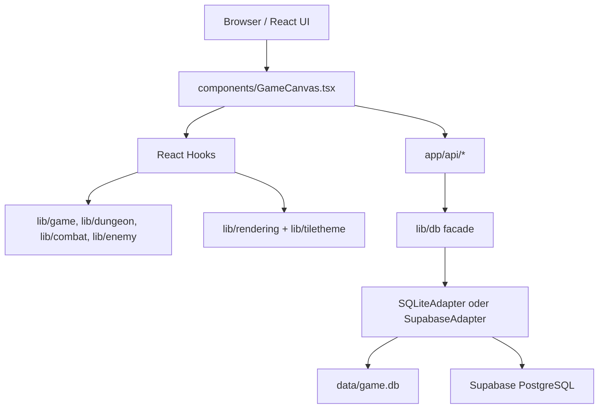

# Architekturuebersicht

**Stand:** 2026-05-04

## Systembild

## Frontend

- Einstieg: `app/page.tsx` rendert `components/GameCanvas.tsx`.
- `GameCanvas` orchestriert Auth, Game-State, Combat, Scoring, XP, Inventar, Shrine-Flow, Pause/Options und Overlays.
- Rendering laeuft ueber HTML Canvas, nicht mehr ueber Phaser.
- Wichtige UI-Komponenten:
  - `CombatModal.tsx`
  - `CharacterPanel.tsx`
  - `InventoryModal.tsx`
  - `SkillDashboard.tsx`
  - `PauseMenu.tsx`
  - `OptionsMenu.tsx`
  - `ShrineBuffModal.tsx`

## Hooks

- `useAuth`: Login/Logout, User-ID, Username, XP-State.
- `useGameState`: Game Loop, DungeonManager, GameEngine, Renderer, Input, Trashmob-Damage, Angriffe.
- `useCombat`: Quiz-Combat-State, Fragen, Timer, Damage, XP, Drops und Answer-Logging.
- `useScoring`: Session-ELO-Anzeige.
- `useCombo`: Combo-System und Damage-Bonus.
- `useShrine`: Shrine-Proximity und Aktivierung.
- `useAudioSettings`, `useFootsteps`: Audio-Konfiguration und Schritte.

## Game Logic

- `lib/game/DungeonManager.ts`: Haelt Dungeon-Struktur, Entities, Themes und startet neue Dungeons.
- `lib/game/DungeonInitializer.ts`: Erzeugt Dungeon-Struktur mit Seeds.
- `lib/game/EntitySpawner.ts`: Spawnt Player, Quiz-Gegner, Trashmobs, Treasures und Shrines.
- `lib/game/GameEngine.ts`: Player-Update, Enemy-Update, Trashmob-Update, Angriff, Raumstatus.
- `lib/dungeon/*`: BSP, UnionFind, SeededRandom und RNG-State.
- `lib/enemy/*`: Enemy-AI, Movement, Aggro, Renderer, Trashmob.
- `lib/combat/*`: Damage, CombatEngine, QuestionSelector, AnswerShuffler, Reducer.
- `lib/items/*`: Item-Datenbank, LootGenerator, Equipment-Boni.
- `lib/buff/*`: Shrine-Buffs und Regeneration.
- `lib/effects/*`: Partikel, ScreenShake, Fog/Transition-Effekte.

## Rendering

- `lib/rendering/GameRenderer.ts`: Hauptcanvas mit Dungeon, Entities, Shrines, Trashmobs und Attack-Visualisierung.
- `lib/rendering/MinimapRenderer.ts`: Minimap.
- `lib/rendering/TileRenderer.ts`: Tile-spezifisches Rendering.
- `lib/tiletheme/*`: ThemeLoader, ThemeRenderer, RenderMapGenerator, ThemeValidator und DB-Funktionen.
- `lib/rendering/canvasUtils.ts` enthaelt gemeinsame Canvas-Helfer.

## API-Routen

| Route | Zweck |
| --- | --- |
| `POST /api/auth/login` | Username Login oder User-Erstellung |
| `POST /api/auth/logout` | Clientseitiger Logout-Flow |
| `GET /api/questions` | Alle Fragen nach Fach gruppiert |
| `GET /api/questions-with-elo` | Fragen eines Fachs mit User-ELO |
| `GET /api/subjects` | Verfuegbare Faecher |
| `POST /api/answers` | Antwort loggen |
| `GET /api/stats` | Skill-Dashboard-Daten |
| `GET /api/session-elo` | Session-ELO-Ausgangswerte |
| `POST /api/xp` | XP loggen und User-XP erhoehen |
| `GET/POST /api/highscores` | Highscores lesen/speichern |
| `GET/POST /api/editor/levels` | Editor-Level lesen/speichern |
| `GET/PUT/DELETE /api/editor/levels/[id]` | Einzelnes Editor-Level verwalten |
| `GET /api/theme/[id]` | Runtime-Tiletheme laden |
| `GET/POST /api/tilemapeditor/*` | Tilemap-Editor-Daten verwalten |

Alle Routen verwenden `withErrorHandler` fuer konsistente Fehlerantworten.

## Datenbank

Der Zugriff laeuft ueber `lib/db` und den Adapter-Contract in `lib/db/adapters/types.ts`.

- Lokal ohne Supabase-Env: `SQLiteAdapter` mit `data/game.db`.
- Wenn `NEXT_PUBLIC_SUPABASE_URL` und `SUPABASE_SECRET_KEY` oder `SUPABASE_SERVICE_ROLE_KEY` gesetzt sind: `SupabaseAdapter`.
- Auf Vercel ohne Supabase-Konfiguration wird absichtlich ein Fehler geworfen.

### Tabellen

- `users`
- `questions`
- `answer_log`
- `xp_log`
- `highscores`
- `editor_levels`
- Tiletheme-Tabellen aus `supabase/migrations/20241225000007_create_tiletheme_tables.sql`

## Persistenzgrenzen

Persistiert werden User, Fragen, Antworten, XP, Highscores, Editor-Level und Tiletheme-Daten. Nicht persistiert werden der aktuelle Dungeon-Run, Positionen, Gegnerzustand, Inventar im laufenden Run und Combat-State.

## Aktuelle technische Risiken

- Client vertraut sich selbst bei Combat- und XP-Ereignissen.
- Supabase-Setup braucht frische E2E-Verifikation.
- RNG nutzt noch globale State-Mutation und ist dadurch schwer testbar.
- Grosse Orchestratoren (`GameCanvas`, `useCombat`, `useGameState`, `GameEngine`) sind funktional, aber weiterhin Refactoring-Kandidaten.
- Testabdeckung fuer Kernalgorithmen ist geplant, aber nicht erkennbar etabliert.
